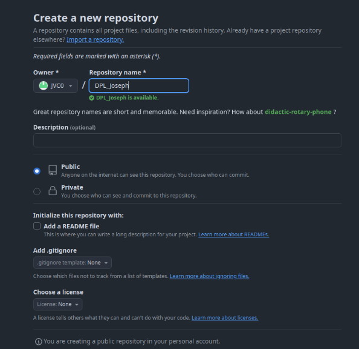
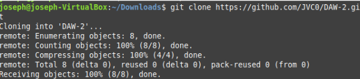
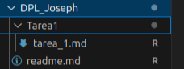
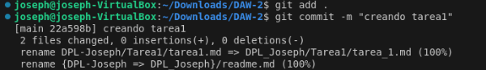
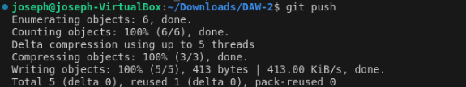
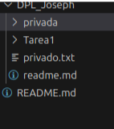
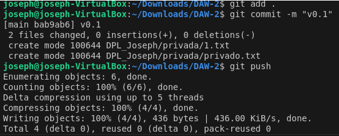

# Tarea1
# Tarea 1.1- Trabajando con Git y MarkDown I

Para la entrega de esta y las sucesivas tareas/prácticas que hagamos durante el curso haremos uso de GitHub, deberán enviarme a través de Campus el enlace a la práctica así como el commit que indique la fecha de entrega. Este commit debe reflejar una fecha que se encuentre dentro del plazo establecido para la realización de la práctica marcado a través de la plataforma Campus, en caso contrario se dará por suspendida la práctica.

##### CREACIÓN DEL REPOSITORIO _(1 PUNTO)_

* Crear una cuenta en GitHub si aún no la tienes.
* Crear un repositorio en vuestro GitHub llamado DPL_A_nombre ( DPL_A_Alejandro )

* Clonar el repositorio en local.

##### CREACIÓN DEL ARCHIVO README _(1 PUNTO)_

* Crear ( si no lo habéis hecho ya ) en vuestro repositorio local un documento tarea1_1.md, en este documento  tendrán que ir poniendo los comandos que han utilizado durante el ejercicio, las explicaciones y capturas de pantalla que consideren necesarias.
* 

##### COMMIT INICIAL _(1 PUNTO)_

* Añadir al tarea1_1.md los  comandos utilizados hasta ahora y hacer un commit inicial con el mensaje commit inicial.

    

##### PUSH INICIAL _(1 PUNTO)_

* Subir los cambios al repositorio remoto

    

##### IGNORAR ARCHIVOS _(1 PUNTO)_

* Crear en el repositorio local un fichero llamado privado.txt.
* Crear en el repositorio local una carpeta llamada privada.
* Realizar los cambios oportunos para que tanto el archivo como la carpeta sean ignorados por git. ( Incluir capturas de pantalla )
* 

##### AÑADIR FICHERO 1.txt _(1 PUNTO)_

* Añadir 1.txt al repositorio local.

##### CREAR EL TAG v0.1 _(1 PUNTO)_

* Crear un tag v0.1

##### SUBIR EL TAG v0.1 _(1 PUNTO)_

* Subir los cambios al repositorio remoto.

#####  CONFIGURACIÓN Y USO SOCIAL DE  GITHUB _(1 PUNTO)_

* Poner una foto en vuestro perfil de GitHub.
* Poner el doble factor de autentificación en vuestra cuenta de GitHub.
* Seguir los repositorios  de vuestros compañeros.
* Añadir una estrella a los repositorios  del resto de tus compañeros.

##### CREAR UNA TABLA _(1 PUNTO)_

* Crear una tabla de este estilo en el fichero tarea1_1.md con la información de varios de tus compañeros de clase:

| Nombre    | Github |
| -------- | ------- |
| Miguel  | [GRMiguelAngel](https://github.com/GRMiguelAngel)    |
| Angel |  [Angel170605](https://github.com/Angel170605)     |
| German   |[GermanOjeda](https://github.com/GermanOjeda)   |