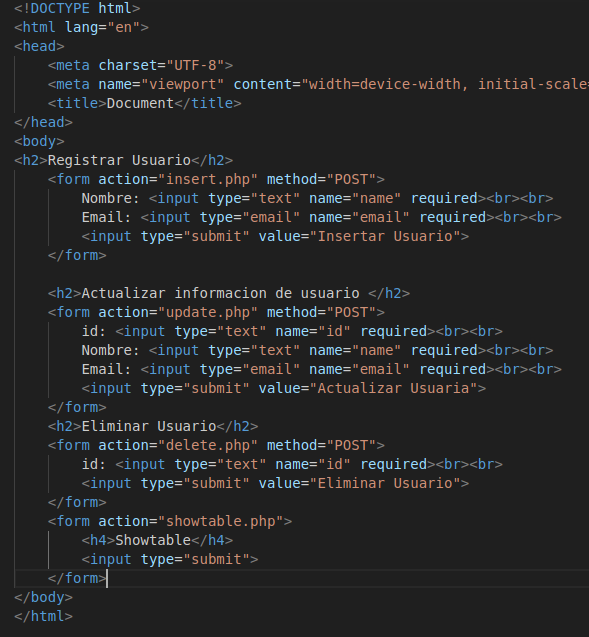

### Index the formulario



### Registrar

```php
<?php
echo "<pre>";


$con = mysqli_connect('localhost', 'joseph', 'jobany5232', 'Prueba');


if (!$con) {
    die("Connection failed: " . mysqli_connect_error());
}


$name = $_POST['name'];
$email = $_POST['email'];


$sql = "INSERT INTO users (name, email) VALUES ('$name', '$email')";

$result = mysqli_query($con, $sql);

if ($result) {
    echo "El usuario se ha registrado con éxito.";
} else {
    echo "Error al insertar: " . mysqli_error($con);
}


mysqli_close($con);
?>


```

### Actualizar

```php
<?php
echo "<pre>";
$con = mysqli_connect('localhost','joseph','jobany5232','Prueba');

if (!$con) {
    die("Connection failed: " . mysqli_connect_error());
}
$name = $_POST['name'];
$email = $_POST['email'];
$id = $_POST['id'];

$sql = "UPDATE users SET email='$email',name='$name' where id = '$id'";

$result = mysqli_query($con, $sql);

 if ($result) {
        echo "El usuario se ha actualizado con éxito.";
    } else {
        echo "Error al actualizado: " . mysqli_error($con);
    }
mysqli_close($con);


?>

```

### Eliminar

```php
<?php
echo "<pre>";
$con = mysqli_connect('localhost','joseph','jobany5232','Prueba');


$id = $_POST['id'];

$sql = "DELETE FROM users WHERE id=$id";

$result = mysqli_query($con, $sql);

if ($result) {
    echo "El usuario se ha eliminado con éxito.";
} else {
    echo "Error al eliminar: " . mysqli_error($con);
}


mysqli_close($con);
?>

```

### Showtable

```php
<?php

$con = mysqli_connect('localhost', 'joseph', 'jobany5232', 'Prueba');


if (!$con) {
    die("Connection failed: " . mysqli_connect_error());
}

$sql = "SELECT id, name, email FROM users";
$result = mysqli_query($con, $sql);


echo "<div style='display: flex; flex-wrap: wrap;'>"; 

if (mysqli_num_rows($result) > 0) {
    while($row = mysqli_fetch_assoc($result)) {

        echo "
        <div style='border: 1px solid #000; padding: 20px; margin: 10px; width: 200px; box-shadow: 2px 2px 5px rgba(0,0,0,0.2);'>
            <h3>ID: {$row['id']}</h3>
            <p><strong>Nombre:</strong> {$row['name']}</p>
            <p><strong>Email:</strong> {$row['email']}</p>
        </div>";
    }
} else {
    echo "No se encontraron resultados.";
}

echo "</div>"; 

mysqli_close($con);
?>

```