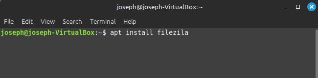
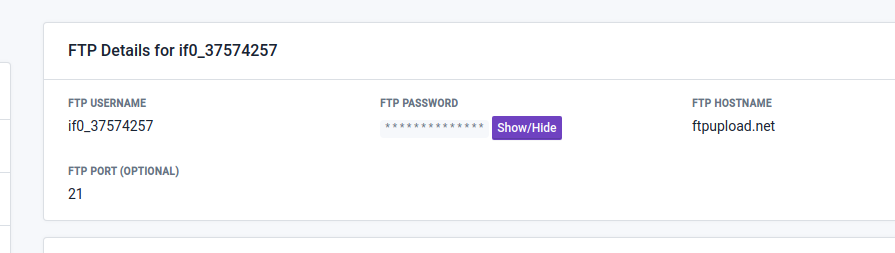
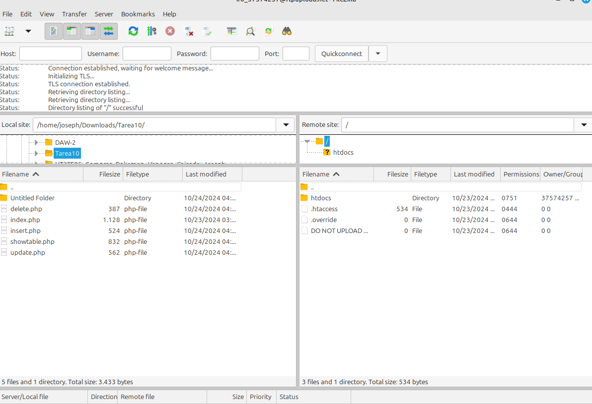
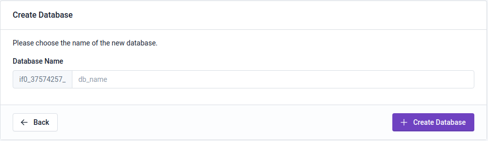
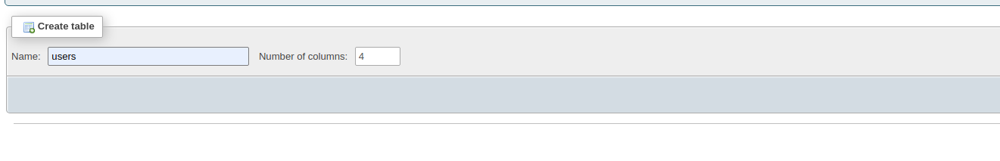
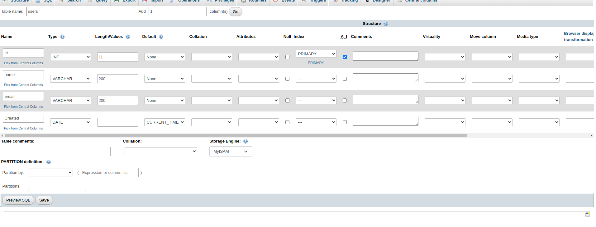
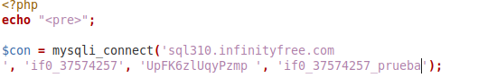
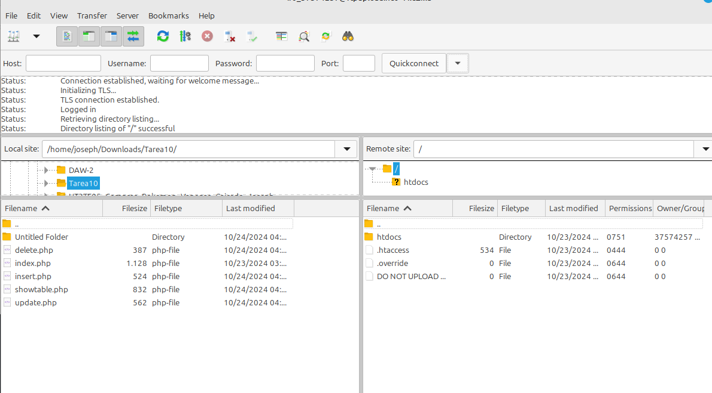

### instalo el filezilla con el comando apt install

### Creo una cuenta infinityfree y me voy al panel ftp

### abro filezilla y pongo la informacion de el ftp

### creo una base de datos con el infinity free

### creo una tabla  en la base de datos llamada users

### inserto la informacion en cada seccion 

### cambio en todos my documentos la conneccion a la base de datos

muevo mis ficheros php con el filezilla
