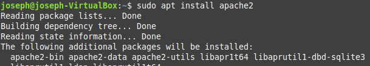
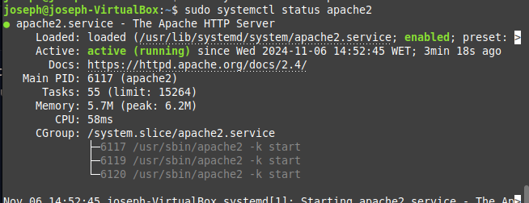
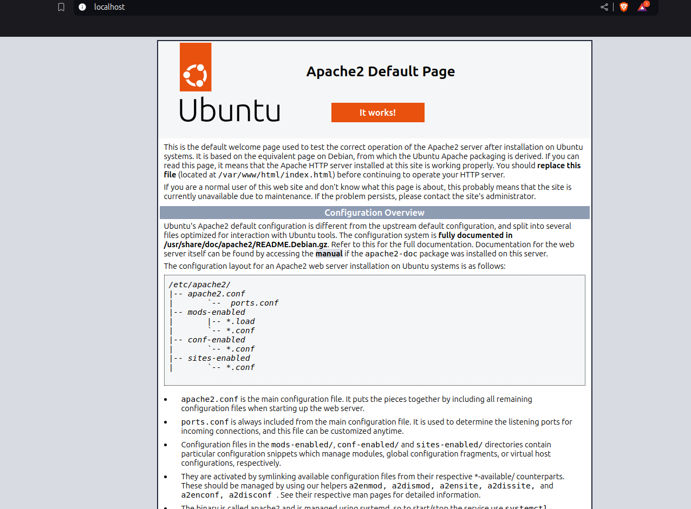
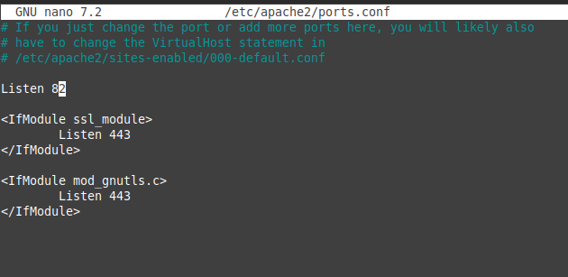
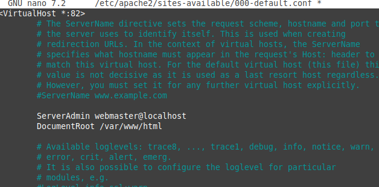
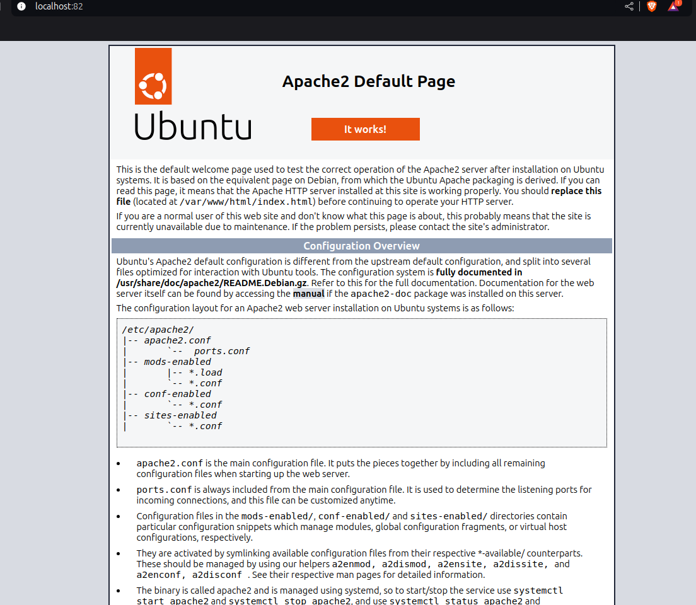

# La arquitectura Web es un modelo compuesto de tres capas, ¿cuáles son y cuál es la función de cada una de ellas?
### 1 Capa de Presentación
Es la interfaz gráfica con la que interactúan los usuarios.

### 2 Capa de Lógica de Negocio
Procesa la lógica y las reglas de negocio. Se encarga del funcionamiento interno de la aplicación.

### 3 Capa de Datos
Se encarga de almacenar y gestionar los datos.

# Una plataforma web es el entorno de desarrollo de software empleado para diseñar y ejecutar un sitio web; destacan dos plataformas web, LAMP y WISA. Explica en qué consiste cada una de ellas.

LAMP es un conjunto de tecnologías que sirven como motor para numerosas aplicaciones web. y WISA es una plataforma que combina tecnologías de Microsoft para el desarrollo web

# Installacion apache

# Cambiando el puerto

### Abro el documento de configuracion de puertos de apache y cambio el puerto de 80 a 82

###  Me voy a otra camperta de configuracion de apache y cambio el puerto otra vez de 80 a 82

### en esta imagen puedes ver que el puerto ya esta cambiado.
