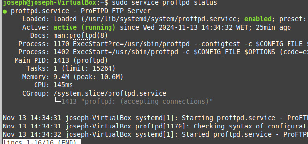
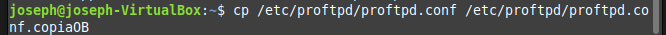

### installar proftp

### revisar si el status del proftp

### hacer una copia de seguridad del archivo de configuración de proftp

### quitar los espacios y las lineas en blanco del archivo de configuración de proftp

### habrir el servidor ftp con 127.0.0.1

### cambiar la configuraciond el ftp

### Añadir mensaje de entrada y de denegado

### recargo el servicio de proftp

### abro el proftp con 127.0.0.1 usando el filezilla
