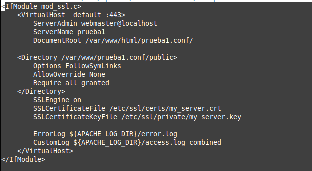

### Instalo apache este comando
```
sudo apt install apache2
```
### instalo openssl
```
sudo apt install openssl
```

### Genero un certificado SSL

```
sudo openssl genrsa -out /etc/ssl/private/my_server.key 2048
```

### Genero un certificado CSR
```
sudo openssl req -new -x509 -key /etc/ssl/private/my_server.key -out /etc/ssl/certs/my_server.crt -days 365
```
### Configuro el archivo de configuración de apache
```
sudo nano /etc/apache2/sites-available/ssl-prueba1.conf
```


### Reseteo la pagina de apache


### abro una la pagina 
