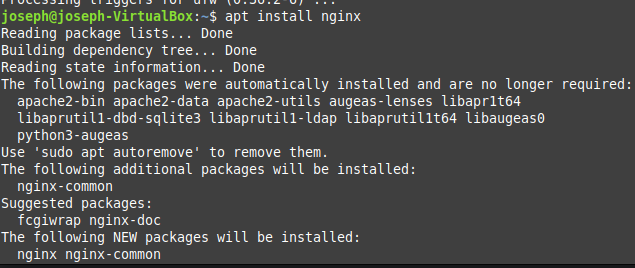
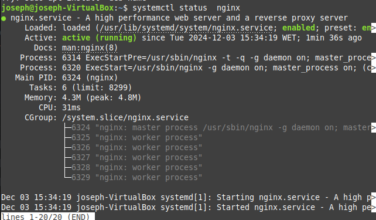
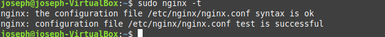
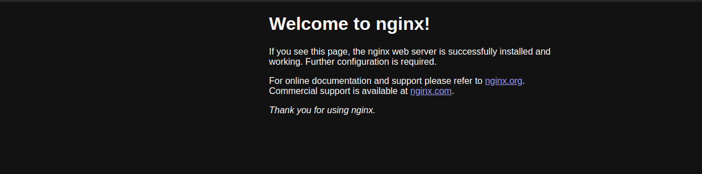
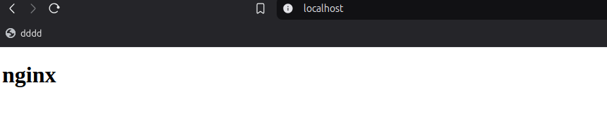

### Instalo el nginx 

### Reviso si el servicio esta corriendo

### utilizo el comando ngix -t para revisar el syntax

### abro el localhost en el navegador

### cambio el index y reseteto el nginx

