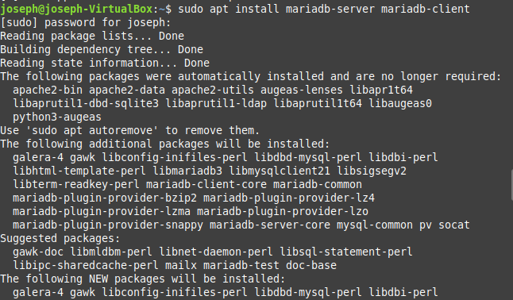
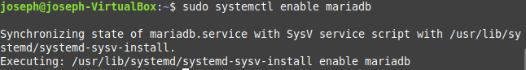
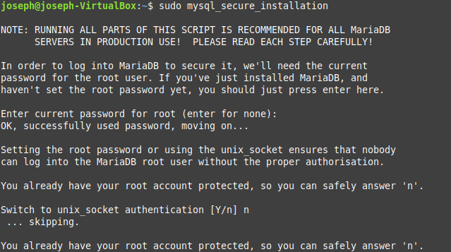
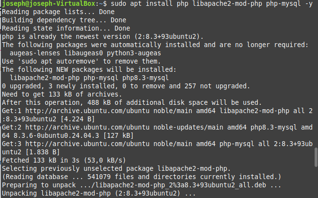
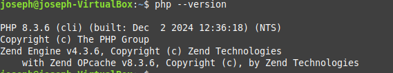
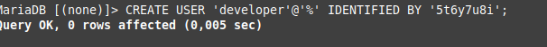
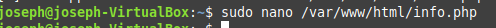
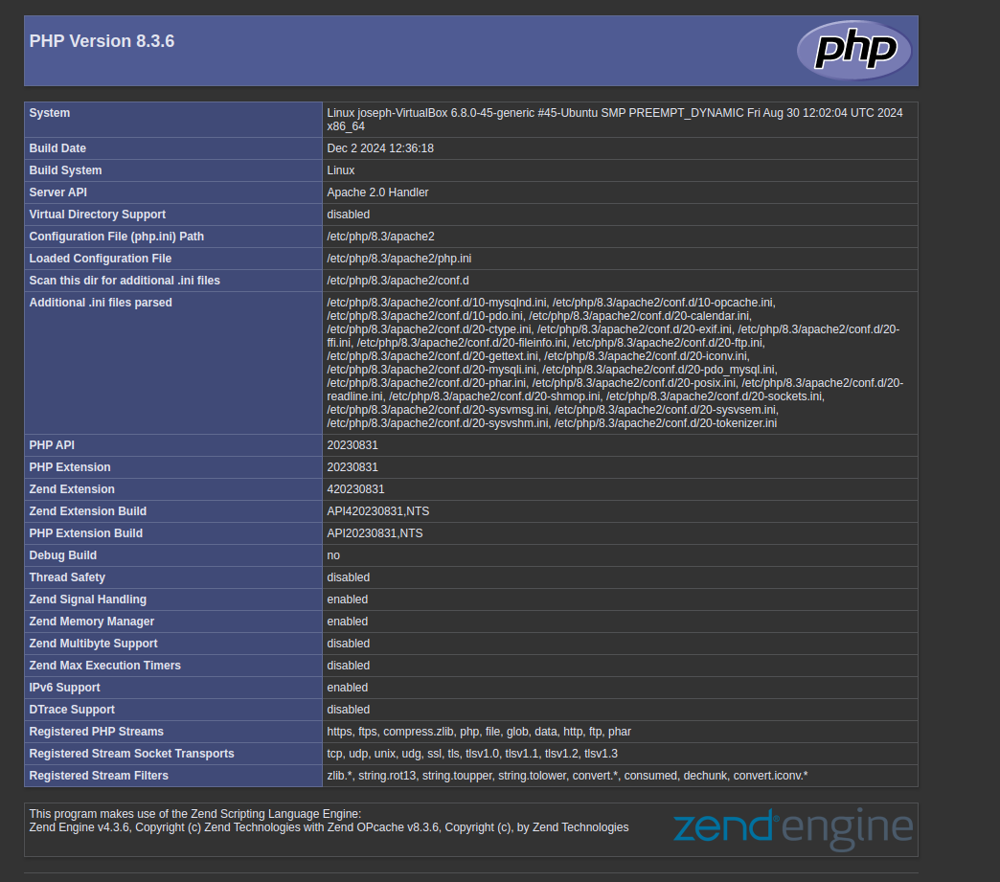

### Instalación de MariaDB Server y Cliente

### Habilitación de MariaDB

### Ejecución del comando mysql_secure_installation Configuración segura de MariaDB

### Instalación de PHP

### Creación del archivo info.php

