### creo los host virtuales

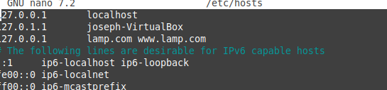

### creo la carpeta lamp.com

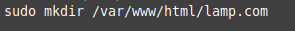

### muevo los archivos de la carpeta xamp a la carpeta lamp.com

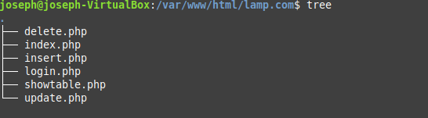

### creo l configuracion lamp

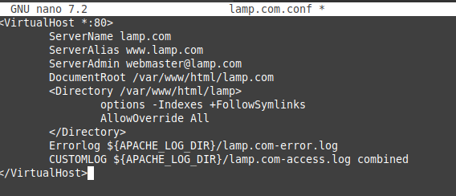

### habilito la configuracion

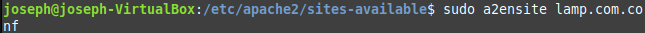

### instalo phpmyadmin

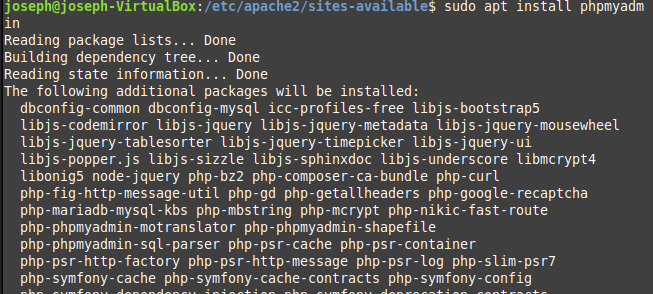

### pongo la configuracion y la habilito

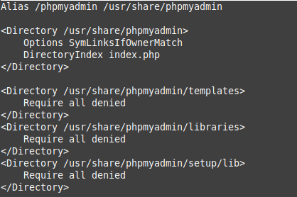

### creo la base de datos

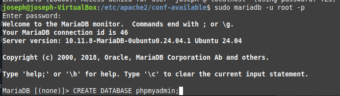

### importo la informacion

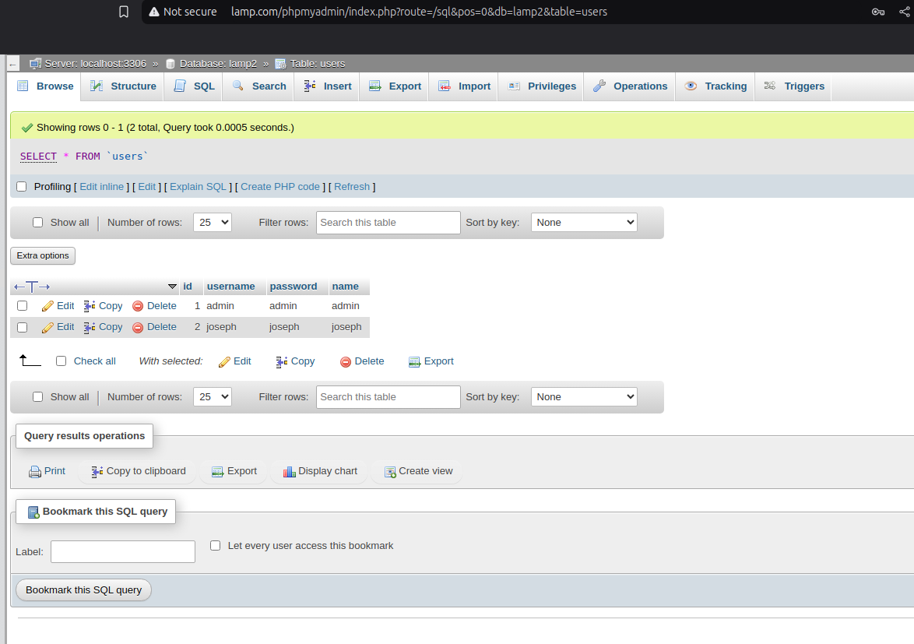

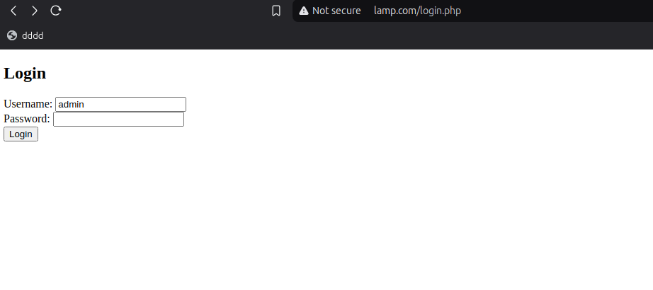

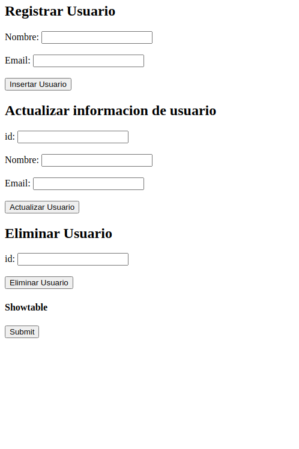