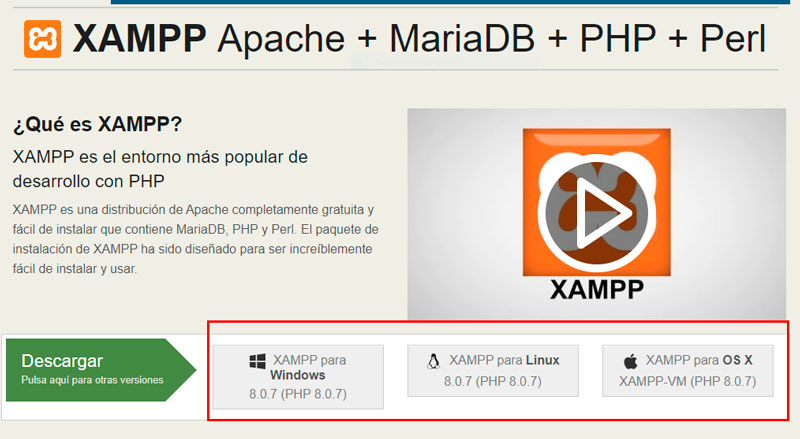
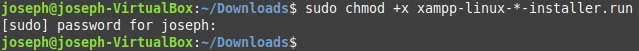
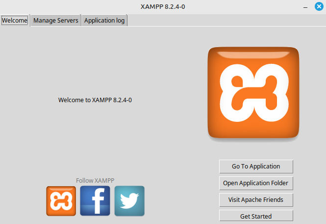
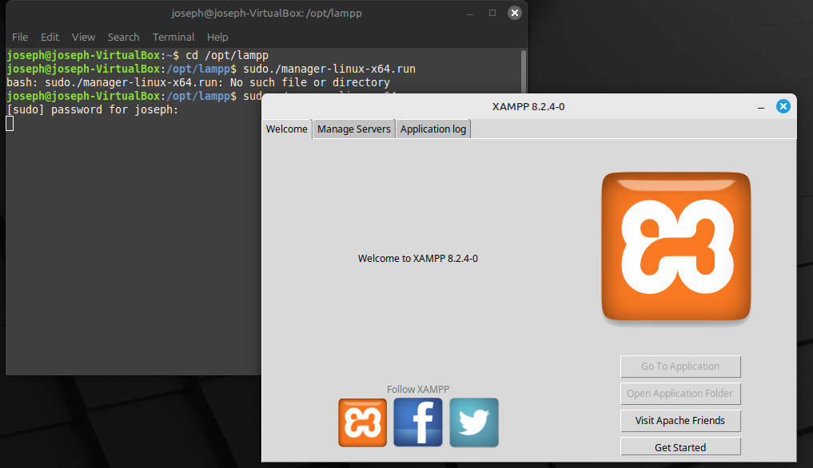
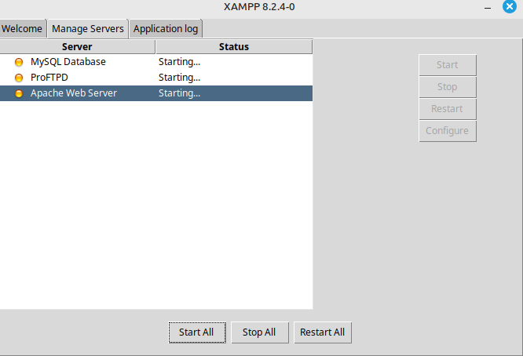
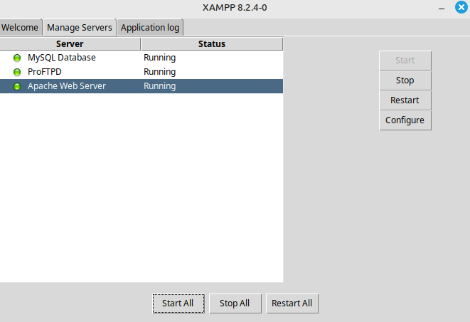

### Descargo xampp desde la pagina 

#### Primero se descarga Xampp



#### Despues se cambia los permisos de el archivo para correrlo



#### Cuando se ejecuta el instalador, se presiona el botón Forward hasta que la instalación se haya completado




#### utilizo el comando cd /opt/lampp para moverme a la carpetay el comando sudo ./manager-linux-x64.run para abrir el panel de control xampp


``` 
cd /opt/lampp
```


#### Para revisar que xampp estaba funcionando bien miro los servidores y los empiezo



#### Los xampp esta funcionado bien por eso los servidores empiensan rapido y esta activo

