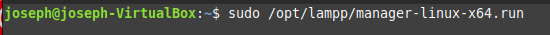
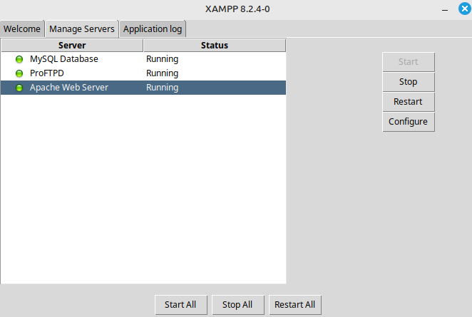
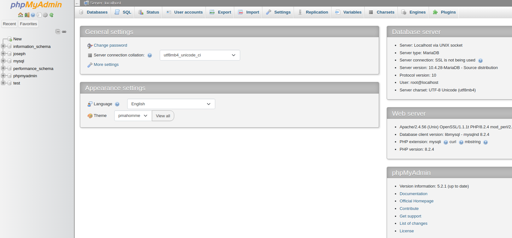
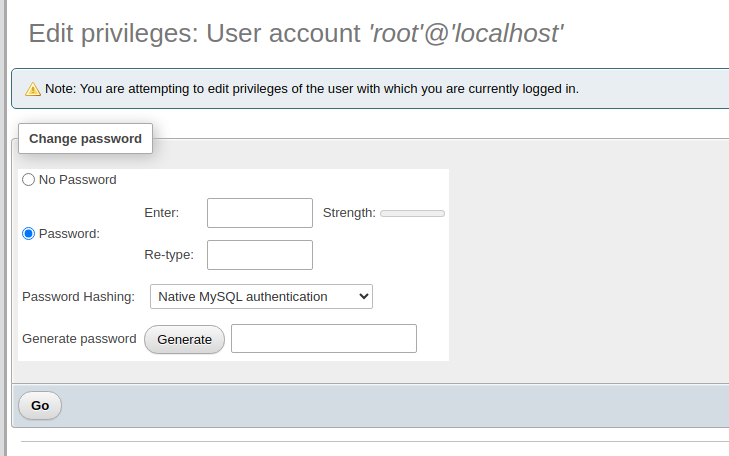
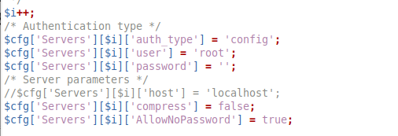
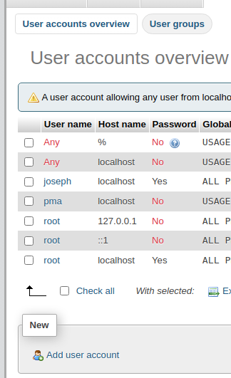
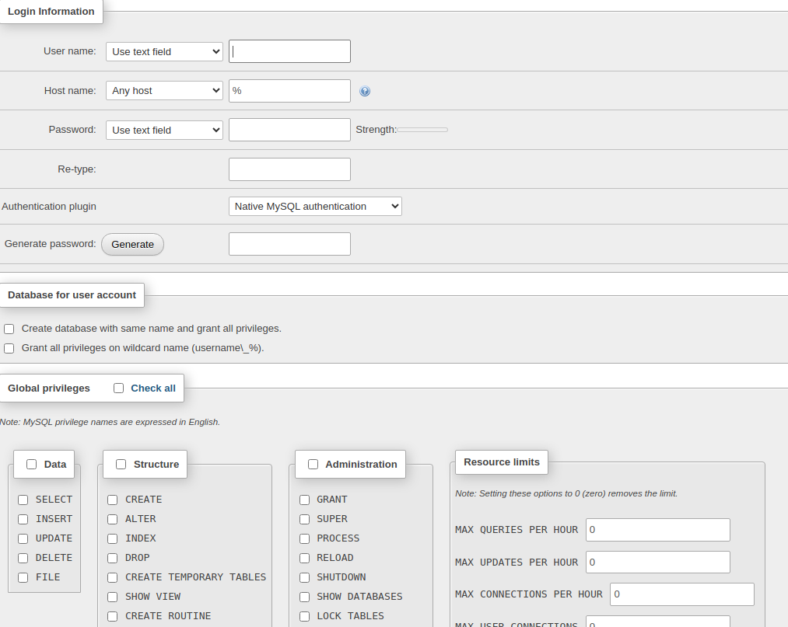
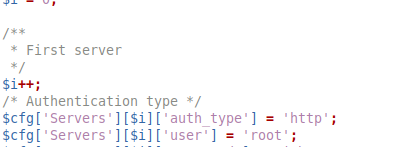
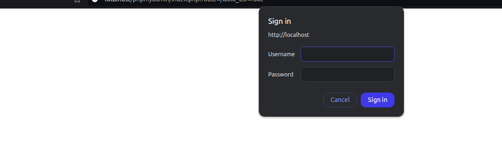

# Seguridad Xampp

#### Enciendo el xamp con el comando 

#### Enciendo los servidores

#### Voy al apartado phpadmin de la pagina localhost

#### Edito la contraseña que esta puesta para el root

#### voy al archivo config.inc y cambio la contraseña de root

#### voy usuarios y le doy añadir 

#### Pongo contraseña privilegios y nombre de usuario

#### vuelvo al documento config.inc.php y cambio config por http 

#### cuando intente volver a meterme en myphpadmin me pedira contraseña

