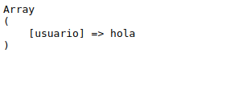
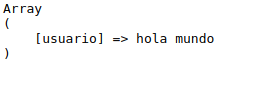

### 1. Primero creas el index.php

```php
<!DOCTYPE html>
<html lang="en">
<head>
    <meta charset="UTF-8">
    <meta name="viewport" content="width=device-width, initial-scale=1.0">
    <title>Document</title>
</head>
<body>
    <form method="post" action="get-post.php" enctype="multipart/form-data">
        Nombre: <input type="text" name="usuario">
        <br>
        Fichero: <input type="file" name="Fichero">
        <br>
        <input type="submit" value="Send">
    </form>    
</body>
</html>

```

### 2. creas un archivo php que en este caso es get-post.php y ponemos el metdodo get

```php
<?php
echo "<pre>";
print_r ($_GET)
>
```


### 3. Ponemos el metodo post

```php
<?php
    echo "<pre>";
    print_r($_POST);
?>
```

