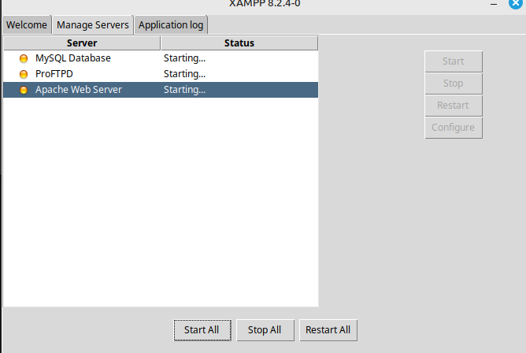
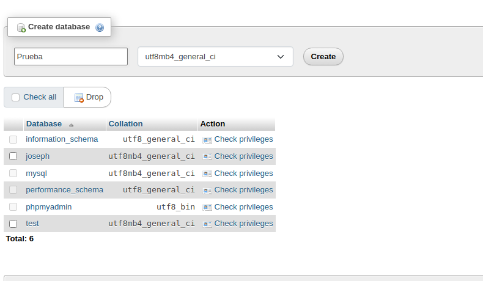
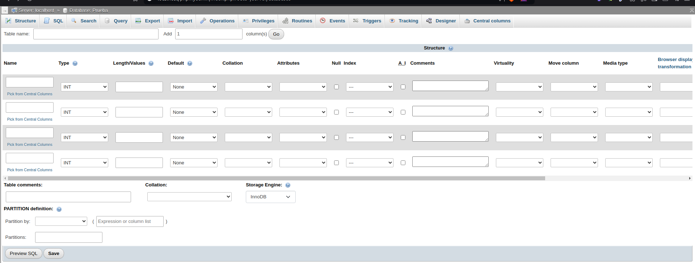
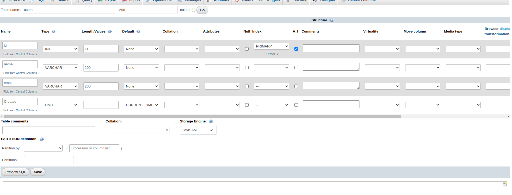
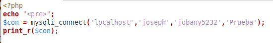
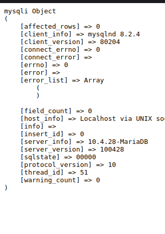

### Abro xampp e inicio los servidores

### Me voy a la pagina de admin y creo una base de datos llamada Prueba

### Pongo la informacion de la base de datos y le doy a crear

### Creo un fichero php donde hago la conexion a la base de datos  y la imprimo

