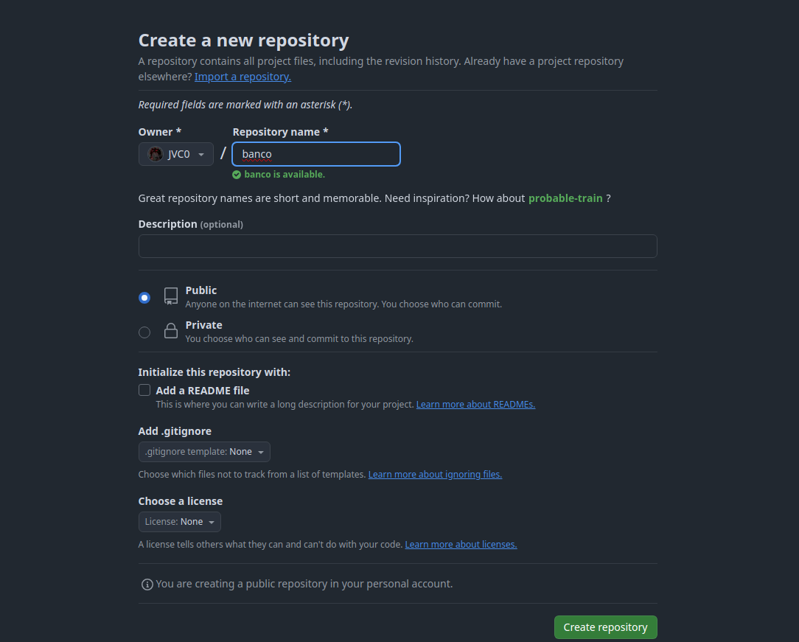
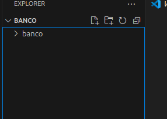

## Crea un repositorio llamado “banco”

## Clona el repositorio desde la linea de comandos

## En otra carpeta crea un proyecto llamado “banco”

## Copia la carpeta del proyecto del banco a la carpeta en la que has clonado el repositorio.

## Haz un commit y push desde Visual Studio.

## Borrar del disco duro todo el código del banco 1

## Clona el proyecto del banco de github a local

## Haz una modificación del código y subelo a GitHub
