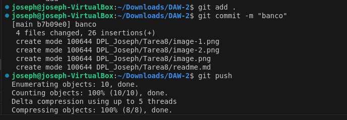

## Crea un repositorio llamado “banco”

## Clona el repositorio desde la linea de comandos

## En otra carpeta crea un proyecto llamado “banco”

## Haz un commit y push desde Visual Studio.

## Clona el proyecto del banco de github a local

## Haz una modificación del código y subelo a GitHub

