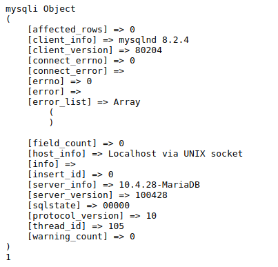

### Primero, me conecto a la base de datos y la guardo en la variable $con. Con la variable $sql, guardamos el comando INSERT para después correrlo con mysqli_query.Salio 1 porque 

```php
<?php
echo "<pre>";
$con = mysqli_connect('localhost','joseph','jobany5232','Prueba');
print_r($con);
$sql = "INSERT INTO users (name, email) VALUES ('Juan', 'juan@gmail.com')";

$result = mysqli_query($con, $sql);
print_r($result)
mysqli_close($con);
?>
```




###  Con este código se conecta a la base de datos, actualiza el email del usuario 'Juan' en la tabla 'user', imprime el resultado de la operación y cierra la conexión a la base de datos.
```php
<?php
echo "<pre>";
$con = mysqli_connect('localhost','joseph','jobany5232','Prueba');

$sql = "UPDATE user SET email='juan@hotmail.com' WHERE nombre='Juan'";
$result = mysqli_query($con, $sql);
print_r($result);
mysqli_close($con);
?>

``` 


### Coneste código se conecta a la base de datos, elimina el registro del usuario con el email 'juan@hotmail.com' de la tabla 'users', imprime el resultado de la operación y cierra la conexión a la base de datos.
```php
<?php
echo "<pre>";
$con = mysqli_connect('localhost','joseph','jobany5232','Prueba');

$sql = "DELETE FROM users WHERE email='juan@hotmail.com'";
$result = mysqli_query($con, $sql);
print_r($result);
mysqli_close($con);
?>
```

